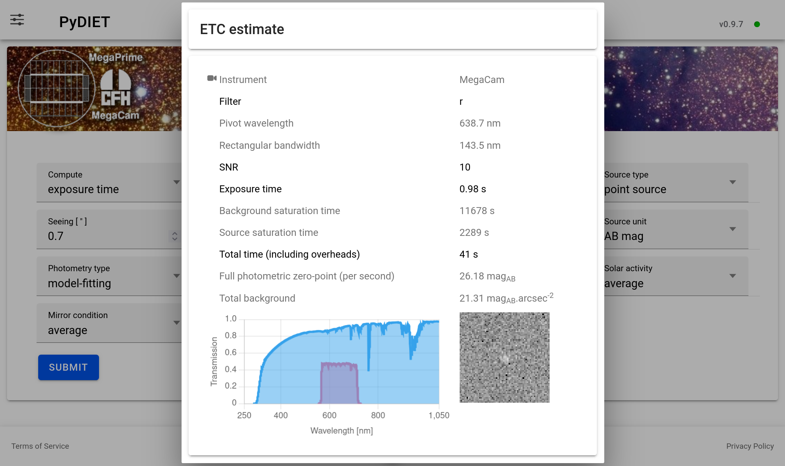

.. File interface.rst

.. include:: global.rst

.. _chap_interface:

=======================
Using the web interface
=======================

|PyDIET| provides a web interface for estimating observing quantities for imaging observations.
The interface can be used either to estimate the exposure time required to reach a target signal-to-noise ratio, or to estimate the signal-to-noise ratio reached for a given exposure time.

The interface is organized as a single calculation form.
Each field describes either the observing setup, the source model, the measurement method, the sky background, or the state of the telescope and atmosphere.

.. note::
   |PyDIET| is an Exposure Time Calculator (|ETC|).
   Its output is an estimate based on an instrumental and atmospheric model.
   Although such models have been statistically validated for the Megacam and Wircam instruments, the result should only be used for planning, comparison, and feasibility estimates, not as a guarantee of on-sky performance.

   In what follows, the |CFHT| symbol indicates features or settings specific to the current provided CFHT configuration.

Overview of the main page
=========================

The main page contains:

* a top navigation bar;
* a settings panel;
* an instrument-specific |ETC| form;
* |CFHT| links to Terms of Service, the CFHT front page, and Privacy Policy.

.. figure:: figures/web_interface.*
   :alt: |PyDIET| web interface
   :align: center

   The main web interface to |PyDIET|.

The top-right corner displays the running |PyDIET| version.
When comparing results or reporting a calculation, make sure to record this version together with the selected instrument, filter, source model, sky model, and observing parameters.
To the right of the |PyDIET| version is a small disk indicating the connection status with the |PyDIET| server:

* a green disk means that a stable connection is established with the server, which is ready to respond to ETC queries.
* a red disk indicates that the server is down, unreachable or excessively busy, and is currently unable to provide a response to ETC queries.

Settings
========

The **Settings** button opens the global settings panel.
These settings affect the web interface and the default calculation context.

Theme
-----

The **Theme** setting changes the visual appearance of the interface. Depending on the deployed version, the available choices may include light, dark, or automatic/system modes.

This option only changes the display of the page.
It has no effect on the ETC model or on the calculated results.

Instrument
----------

The |PyDIET| web interface can provide access to several instruments through a common page.
The **Instrument** setting selects the instrument model and interface used by the ETC.

|CFHT| The current CFHT-oriented configuration includes:

* **MegaCam**, an optical wide-field imager;
* **WIRCam**, a near-infrared imager.

The selected instrument determines which filter list is loaded.
It also selects instrument-specific detector parameters such as gain, readout noise, full well capacity, pixel scale, and quantum efficiency.

The settings panel the documentation, web API, source code repository, 

ETC form
========

The ETC form features a series of widgets that allow the user to describe the observation, and a **Submit** button.
Some of the widgets only show up in certain configurations (e.g., galaxy parameters when selecting a galaxy image model).

Compute
-------

The **Compute** menu selects which quantity |PyDIET| should solve for.

Available choices are:

* ``exposure time``: the user provides a target Signal-to-Noise Ratio (SNR).
  |PyDIET| estimates the exposure time required to reach it.
* ``SNR``: the signal-to-noise input field is replaced by an **Exposure Time [s]** field.
  The user provides the exposure time in seconds, and |PyDIET| estimates the resulting signal-to-noise ratio for the type of source selected.

Internally, both modes use the same noise model.

Exposures
---------

The **Exposures** field sets the number of exposures in the observing sequence.

The default is one exposure. When the number of exposures is greater than one, an additional **Stacking** menu appears.

The number of exposures affects the total integration time and the number of readouts.
Increasing the number of exposures increases the accumulated source signal and sky signal, but also increases the cumulative contribution of readout noise.

For a fixed total exposure time, splitting the observation into many short exposures is therefore not equivalent to taking fewer long exposures, especially in low-background or narrow-band regimes where read noise matters.

Stacking
--------

The **Stacking** menu is shown only when **Exposures** is greater than one.

Available choices are:

* ``average``: |PyDIET| assumes that independent exposures are combined using the mean.
  This preserves the usual :math:`\sqrt{N}` improvement in signal-to-noise ratio for :math:`N` equivalent exposures, apart from additional readout-noise terms.

* ``median``: |PyDIET| applies a correction for the lower statistical efficiency of the median compared with the mean.
  For Gaussian noise, a median stack has a larger variance than an average stack.
  
Median stacking is more robust against cosmic rays, bad pixels, and outliers, but it is not quite as efficient as averaging when all exposures are otherwise clean.
More efficient artifact rejection algorithms exist that provide intermediate SNRs for a given exposure time, so the average and median ones can be used as bounds for the expected SNR or exposure time.

The default is **median**.

Source type
-----------

The **Source type** menu describes the spatial distribution of the astronomical
source.

Available choices are:

* ``point source``: the source is modeled as an unresolved object.
  Its image is controlled mainly by the `seeing <https://en.wikipedia.org/wiki/Astronomical_seeing>`_, the instrumental Point Spread Function (|PSF|_), and sampling by the detector.

  Use this option for stars, unresolved transients, quasars, and compact sources that are not significantly resolved by the instrument.

* ``galaxy``: the source is modeled as an extended source with a pure, axisymmetric `Sérsic surface-brightness profile <https://en.wikipedia.org/wiki/S%C3%A9rsic_profile>`_ convolved with the full |PSF|.
  The resulting image gives a reasonably accurate description of an elliptical or (face-on) disk galaxy.
  It is more extended than a point source, so the source light is spread over more pixels.
  For the same total magnitude, this lowers the achievable SNR because more sky background contributes to the measurement.

* ``extended``: the source is treated as an object with a flat profile, defined by its `surface-brightness <https://en.wikipedia.org/wiki/Surface_brightness>`_ rather than as a finite object with a total magnitude.
  When this option is selected, the photometry menu is hidden and the brightness field changes to a surface brightness quantity per square arcsecond.

  Use this option for diffuse emission, nebular emission, sky-like surface brightness estimates, or extended low-surface-brightness structures where the relevant quantity is flux per unit angular area.

When the **galaxy** option is selected, additional Sérsic profile parameters appear:

Sérsic Rₑ
---------

The **Sérsic Rₑ** field sets the effective angular radius of the galaxy in arcseconds.
This is the radius enclosing half of the intrinsic model flux before convolution with the |PSF|.

Larger values make the source more extended and reduce the signal-to-noise ratio for a fixed total magnitude.

Sérsic index
------------

The **Sérsic index** controls the concentration of the galaxy profile.

A value near 1 corresponds approximately to an exponential disk.
Larger values represent more centrally concentrated profiles, such as bulge-like or elliptical galaxy profiles.

At fixed total magnitude and effective radius, a larger Sérsic index puts more light near the center, which may improve detectability in compact apertures or model-fitting measurements, but can also make the result more sensitive to the seeing model.

Seeing
------

The **Seeing** field sets the delivered image quality in arcseconds in the :ref:`selected filter <chap_filter>`.
It is defined as the angular Full Width at Half-Maximum (|FWHM|_) of the |PSF|, and does not include the pixel footprint.
The default value is 0.7 arcsec.

For point sources and galaxies, worse seeing spreads the source flux over more pixels.
This increases the amount of sky background and detector noise included in the measurement, generally reducing SNR for a fixed exposure time.

Seeing has a weaker effect on a uniform extended source, because both source and sky are surface-brightness-like quantities.
It can still matter if the |ETC| uses a resolution element, aperture, or |PSF|-convolved model.

.. _chap_filter:

Filter
------

The **Filter** menu selects the filter transmission curve used in the calculation.

Changing the filter can strongly affect:

* the number of detected source electrons;
* the sky background;
* the atmospheric extinction;
* the thermal background, especially in the near infrared;
* the conversion between AB magnitude, Vega magnitude, flux density, and photon (electron) counts.

The available filters depend on the selected instrument.

|CFHT| For MegaCam at CFHT, the current configuration includes broad-band filters such as
``u``, ``g``, ``r``, ``i``, ``z``, ``gri`` and several narrow or medium-band
filters such as ``CaHK``, ``OIII``, ``Hα``, and related off-band filters.

|CFHT| For WIRCam, the current configuration includes near-infrared filters such as
``Y``, ``J``, ``H``, ``Ks``, ``H2``, ``Low OH``, ``CH4 on/off``, ``K cont.``,
``Brγ``, and ``W``.

* ``upload``: if available, selecting this option opens a file input for a custom filter transmission curve.
  The uploaded file should be a FITS table file containing the transmission curve.

  This is useful for testing new filters, provisional filters, or user-defined bandpasses without modifying the server-side instrument configuration.

Source magnitude/flux
---------------------

The **Source magnitude** field sets the source flux.

The field label changes depending on the selected source type and source unit.

For point sources and galaxies, the value describes the total source brightness.
For extended sources, it describes a surface brightness per square arcsecond.

Source unit
-----------

The **Source unit** menu selects how the source brightness is interpreted.

Available choices are:

* ``AB mag``: the source brightness is interpreted as an AB magnitude.
  For point sources and galaxies, this is the total AB magnitude of the source.
  For extended sources, it becomes an AB surface brightness in mag.arcsec\ :sup:`-2`.

  |PyDIET| converts the AB magnitude into a spectral flux density normalization and integrates it through the selected total throughput curve.

* ``Vega mag``: the source brightness is interpreted as a Vega-based magnitude.
  For point sources and galaxies, this is the total Vega magnitude.
  For extended sources, it becomes a Vega surface brightness in mag.arcsec\ :sup:`-2`.

  |PyDIET| converts the Vega magnitude to a physical flux using a Vega reference spectrum and the selected bandpass.
  The AB-Vega offset therefore depends on the filter.

* ``μJy``: the source brightness is interpreted as a flux density in microjanskys.
  For extended sources, this becomes μJy.arcsec\ :sup:`-2`.

  |PyDIET| converts the input flux density to a photon rate through the selected bandpass.
  This option is useful when the source flux is already known in physical units rather than as a magnitude.

* ``flux``: the source brightness is interpreted as an integrated physical flux, in units of 10\ :sup:`-15`\ erg.s\ :sup:`-1`.cm\ :sup:`-2` or, for extended sources, 10\ :sup:`-15`\ erg.s\ :sup:`-1`.cm\ :sup:`-2`.arcsec\ :sup:`-2`.
  This option is meant for narrow-band calculations.

  PyDIET treats the value as an integrated flux over the selected bandpass.
  For broad-band continuum work, magnitudes or μJy are usually less ambiguous.

Photometry type
---------------

The **Photometry type** menu selects how the source flux is measured.
It is hidden for extended sources.

Available choices are:

* ``model-fitting``: |PyDIET| estimates the source flux by fitting the source model to the image.

  For a point source, the fitted model is the |PSF|.
  For a galaxy, it is the seeing-convolved Sérsic model.

  In the idealized Gaussian white noise limit, model fitting provides an efficient flux estimator because pixels are weighted according to the expected source profile and noise variance.
  It usually gives the best formal SNR when the source model is accurate.

* ``Optimal aperture``: |PyDIET| chooses an aperture that maximizes the expected SNR for the selected source, seeing, sky background, and detector noise.

  For a point source, the optimal aperture is usually a compromise: a larger aperture includes more source flux but also more sky noise.
  The optimum is therefore smaller than an aperture that captures nearly all the flux.

  For galaxies, the optimum depends on the Sérsic radius and index as well as the seeing.

* ``96% flux aperture``: |PyDIET| uses an aperture large enough to contain approximately 96% of the source flux.
  It includes most of the source flux but also generally includes more background noise than a strictly optimal aperture.

  It is useful when the goal is close to total-flux photometry rather than maximum SNR.

* ``fixed aperture``: |PyDIET| uses a user-specified aperture diameter.

  Selecting this option reveals the :ref:`Aperture diameter <chap_aperture_diameter>` field.

  The ETC integrates the source model inside the specified aperture and computes the sky and detector noise over the corresponding number of pixels.
  A small aperture reduces sky noise but misses more source flux.
  A large aperture captures more source flux but includes more sky background.
  The best value depends on the seeing, source morphology, and science goal.

.. _chap_aperture_diameter:

Aperture diameter
-----------------

The **Aperture diameter** field is shown only when **fixed aperture** is selected.
The value sets the aperture diameter in arcseconds.

Sky brightness
--------------

The **Sky brightness** menu selects the background model.

Available choices are:

* ``dark``: sets a dark-time |CFHT| sky model, with the Moon set at nadir.
  |PyDIET| uses a predefined sky emission spectrum for dark conditions.
  This spectrum contributes background photons in each pixel and therefore affects the noise term.

  In optical bands, the dark-sky emission model is dominated by the airglow and continuum components.
  In the near infrared, it features strong OH emission and thermal terms.

* ``grey``: sets an intermediate lunar background |CFHT| model, with a 30% Moon component (66.4° phase) at 45° elevation and 45° distance from the direction the telescopes is pointing to.

  Compared with the dark model, the sky count rate increases, reducing the SNR for background-limited observations or increasing the exposure time needed to reach a target SNR.

* ``bright``: sets a high-background lunar |CFHT| sky model, with a 60% Moon component (101.5° phase) at 45° elevation and 45° distance from the pointed direction.
  The impact is strongest in blue and optical bands.
  It is much less dominant in near-infrared bands where OH airglow and thermal background already contribute strongly.

* ``specify``: this option lets the user enter the sky brightness manually.
  When it is selected, two additional fields appear: :ref:`Sky value <chap_sky_value>` and :ref:`Sky unit <chap_sky_unit>`.

  Instead of selecting a predefined sky emission spectrum by sky category, |PyDIET| uses the user-provided sky brightness.
  This option is helpful when the user has a measured sky brightness or wants to reproduce a known observing condition.

.. _chap_sky_value:

Sky value
---------

The **Sky value** field sets the numerical value of the manually specified sky
brightness.
It is shown only when **Sky brightness** is set to ``specify``.

.. _chap_sky_unit:

Sky unit
--------

The **Sky unit** menu selects the unit used for the manual sky brightness.

Available choices are:

* ``AB mag.arcsec⁻²``: the sky value is interpreted as an AB surface brightness.

  |PyDIET| converts the AB surface brightness into a photon rate per unit angular area, then into electrons per pixel using the pixel scale, throughput, and detector quantum efficiency.

* ``Vega mag.arcsec⁻²``: the sky value is interpreted as a Vega-based surface brightness.

  |PyDIET| converts the Vega surface brightness through the selected bandpass.
  The AB-Vega offset is filter-dependent.

* ``MJy.sr⁻¹``: the sky value is interpreted as a surface brightness in megajanskys per steradian.

  This is a common infrared surface-brightness unit.
  |PyDIET| converts it to a flux density per angular area and then to detected electrons per pixel through the selected filter and throughput model.

* ``flux.arcsec⁻²``: the sky value is interpreted as a physical flux per square arcsecond, in units of 10\ :sup:`-15`\ erg.s\ :sup:`-1`.cm\ :sup:`-2`.arcsec\ :sup:`-2`.

  |PyDIET| converts the physical sky flux into a photon/electron rate over the selected bandpass.
  This option is primarily meant to quantify backgrounds through narrow-band filters, or for matching an external sky model.

* ``e⁻.s⁻¹.px⁻¹``: the sky value is interpreted directly as a detected electron rate per pixel.

  This option bypasses most of the photometric conversion for the sky background.
  The entered value is used directly as the background count rate in the detector noise model, and contrary to other settings, no instrumental thermal component is added.

Airmass
-------

The **Airmass** field describes the line-of-sight optical path through the atmosphere.
The default value is 1.2.

Airmass affects both atmospheric transmission and sky emission.
Larger airmass usually reduces source throughput because the source light crosses more atmosphere.
It can also increase the sky emission and the contribution from scattered light.

In |PyDIET|, atmospheric transmission and sky emission are tabulated for discrete airmass values, and interpolated between the closest available models.

Solar activity
--------------

The **Solar activity** menu selects the solar-activity level used in the sky emission model.

Solar activity modulates airglow emission.
This can raise or lower the sky background, especially in the near ultraviolet, optical, and some near-infrared airglow features, impacting the SNR for a given exposure time.

Available choices are:

* ``low``: corresponds to a low solar radio flux model, 70 `solar flux units (sfu) <https://en.wikipedia.org/wiki/Solar_flux_unit>`_ with the provided |CFHT| sky model configuration.

  Low solar activity generally reduces some airglow components, especially in the ultraviolet and optical where upper-atmosphere emission can matter.
  It therefore produces a darker natural sky background than the average or high solar-activity models.

* ``average``: corresponds to an intermediate solar radio flux model, 130 sfu with the provided |CFHT| sky model configuration.

  This is the default solar-activity assumption and should be used for generic planning when no more specific information, such as the observing year, is available.
  It represents a typical sky-emission state averaged over the whole solar cycle.

* ``high``: corresponds to a high solar radio flux model, 200 sfu in the current |CFHT| configuration.

Mirror condition
----------------

The **Mirror condition** menu selects the telescope mirror throughput model.

Available choices are:

* ``pristine``: represents a freshly coated or nearly freshly coated mirror.
  This option gives the highest mirror reflectivity.
  It increases the source count rate and can also increase the sky count rate, since both source and sky photons are reflected by the telescope.

  In most source-limited or read-noise-limited regimes, a pristine mirror significantly improves SNR.
  In strongly background-limited regimes, the gain is more modest because both signal and sky background increase.

* ``average``: represents the average mirror state between recoatings.

  This is the default and should be used for ordinary planning.

  |CFHT| At CFHT mirror recoating is typically done every 3 years.
  As zero-point degradation is roughly linear with time, the ``average`` mirror condition corresponds to 1.5 years after recoating.

* ``degraded``: represents an older or less reflective mirror coating.

  This option lowers even further the telescope throughput.

  |CFHT| at CFHT it corresponds to 3 years after recoating.

Transparency
------------

The **Transparency** field is a generic, multiplicative atmospheric transparency factor between 0 and 1.

The default value is 1.0.

Transparency scales the amount of source light transmitted through the atmosphere relative to the nominal atmospheric model irrespective of the wavelength (grey absorption), while the sky background is unaffected.
A value of 1.0 represents nominal clear conditions.
A lower value represents additional attenuation from clouds, cirrus, aerosols, or more generally, non-photometric conditions, impacting the SNR at a given exposure time.

Submitting a calculation
========================

After selecting the desired parameters, press **Submit**.

|PyDIET| sends the form values to the backend, and the result is displayed in a result panel.

Results
=======

The result panel reports the requested output quantity, exposure time and SNR, together with supporting quantities:

* **Instrument name**: the instrument that was selected in the settings panel.
* **Filter name**: the filter selected for that instrument.
* **Pivot wavelength**: a measure of the effective wavelength of the combined instrument+atmospheric response :math:`T(\lambda)`.
  It is defined as the wavelength that makes the broadband conversion between :math:`f_\nu` and :math:`f_\lambda` exact for this bandpass:

  .. math::

    \lambda_{\rm piv} = \sqrt{\frac{\int T(\lambda)\lambda d\lambda}{\int T(\lambda)\lambda^{-1} d\lambda}}.

* **Rectangular bandwidth**: the width of an ideal top-hat filter that would transmit the same total amount of light as the combined instrument+atmospheric response :math:`T(\lambda)`, and have identical peak transmission:

  .. math::

    \Delta\lambda_{\rm rect} = \frac{\int T{\lambda} d\lambda}{T_{\rm max}}.

* **Signal-to-noise ratio**: the ratio between the expected signal from the (stacked) photometric source measurement and its standard deviation.
* **Exposure time**: the expected individual exposure time(s) required for the (stacked) photometric source measurement to match the provided Signal-to-Noise Ratio.
* **Background saturation time**: the expected exposure time required to saturate the combined sky+instrumental background.
* **Source saturation time**: the expected exposure time required to saturate the source peak signal.
* **Total time (including overheads)**: the sum of exposure times and instrumental overheads for the whole observation sequence.
* **Full photometric magnitude zero-point** "per second": estimated AB magnitude zero-point of the combined instrument+atmosphere system for a one second exposure.
* **Background surface brightness** (in mag..arcsec\ :sup:`-2`): estimated surface brightness (in AB magnitudes per square arsecond) of the combined sky+instrumental background.

   Example result panel.

Caveats
=======

The ETC result is only as accurate as the adopted model.
The current model ignores the following effects:

* source crowding and contamination by neighboring objects
* imperfect flat-fielding
* background subtraction systematics
* |PSF| variations over the field of view
* detector persistence and non-linearity
* fringing or scattered light
* changing sky transparency during the exposure sequence
* cosmic ray hits and cosmetic defects
* calibration uncertainties;
* observer-specific reduction choices.

For critical observing programs, use |PyDIET| as one input to the planning process and compare with measured performance from similar observations when available.

